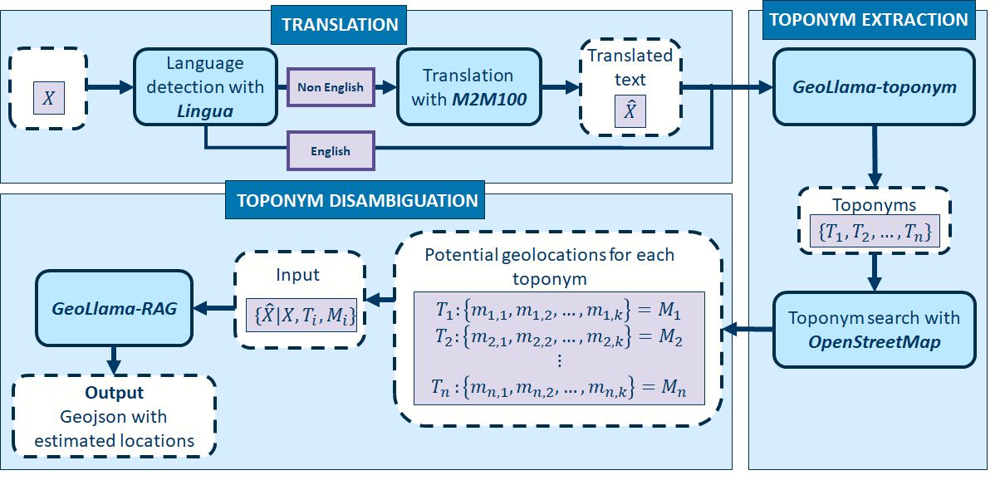

# GeoLlama
### A Llama3 based multi-lingual geoparsing pipeline
This app is designed to accurately and consistently translate and geoparse textual data. We use a three step pipeline. First, text is translated using the `M2M100` model from meta, then we extract toponyms using the bespoke fine-tuned `GeoLlama-7b-toponym` model. We then use OpenStreetMaps to find potential geolocations for these toponyms, and use the `GeoLlama-7b-RAG` model to identify which geolocation is most likely to be an accurate representation of the true toponym location. 

This process is outlined in figure1.

## Requirements
*system requirements*
Linux based system with Triton and a Cuda enabled GPU with >12Gb VRAM. Git is required for some dependecies.
* python==3.10
* git installed in environment
Depencencies:
* accelerate==0.33
* geopy
* gradio
* huggingface-hub
* jupyter
* lingua-language-detector
* pandas
* tokenizers
* torch==2.3.1+cu121 # depending on cuda version
* tqdm
* transformers
* unsloth

## Installation
The pack can be installed by running `$ python setup.py install`. Note that installation may fail on native windows machines since the Unsloth package relies on access to Triton, which is currently unavailable on windows. This could be patched by removing the depndency on Unsloth, although this will significantly impact inference time and memory usage.

## Modules
The following modules are included in the package
* `app.py`: sets up the Gradio User Interface if required.
* `gazetteer.py`: handles requests and responses to and from the gazetteer, currently set up to use OpenStreetMap's Nominatim API.
* `geo_llama.py`: contains the `geoparse` function which calls `Model` to geoparse a piece of text.
* `model.py`: contains the `Model` class and `TopoModel` and `RAGModel` subclasses which construct and pass prompts to the model and handle and clean responses.
* `plotting.py`: some utility funcitons to help `app.py` to produce a map.
* `translator.py`: uses the `Lingua-Language-Detector` package and an `M2M100` model to translate text into a provided language. 

## Notebooks
The following notebooks are included:
* `testing.ipynb` : provides a wlakthorugh of running the model on the News2024 dataset.
* `GeoLlama_toponym_extraction_fine_tuning.ipynb` : provides a walkthrough of the fine-tuning process for the toponym extraction model.
* `GeoLlama_RAG_fine_tuning.ipynb` : provides a walkthrough for the fine-tuning process for the retrieval augmented generation model.
* 

## Data
There are a few data files included in the package. the following files are important to the running of the model as they configure the models and prompts.
* `data/config_files/model_config.json` - A JSON file which provides a few key parameters to the modle during setup. This is also where the 'response token' is defined, which is important in seperating the response from the the output, and should reflact what is used in the prompt templates.
* `data/prompt_templates/prompt_template.txt` - this is the template which seperates instruction, input and response. The last line preceding the final `{}` is the response token. If this is changed it shoudl also be changed in `model_config`.
* `data/prompt_templates/rag_input.txt` - this formats the toponym, text and matches for the retrieval augmented generation model. The input for the toponym model is just the original text, so does not need a template file.
* `data/prompt_templates/topo_instruction.txt` - this provides the instructions for toponym extraction, and the expected formatting of the output, for the toponym extraction model.
* `data/prompt_templates/rag_instruction.txt` - provides the instruction and output formatting for the retrieval augmented generation model.

The other data files included are the geotagged news articles used to test the model - `data/test_data/News2024.json`, the results of running the model on that testing data - `data/results/GeoLlama_News2024_results.json` and the data used to fine-tune the RAG and Toponym models - `data/fine_tuning_data/llama3_RAG_geoparsing_ft.json` and `data/fine_tuning_data/llama3_toponym_extraction_ft.json`, respectively.

## Usage
The script `app.py` will deploy a gradio web browser app which runs the model. The model requires significant GPU capabilities to run effectively - typical usage is around 12Gb of GPU RAM. The package can be tested without using the gradio interface in the `testing.ipynb` notebook. This runs through testing the model on the `News2024` dataset - a set of geo-tagged news articles from outside of the training window for Llama3. 